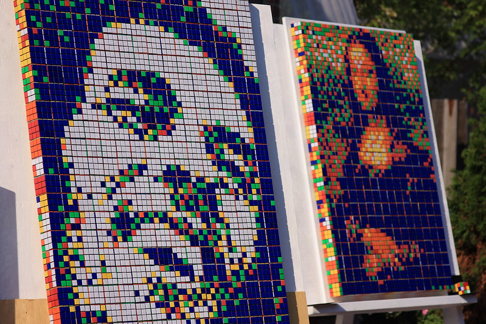
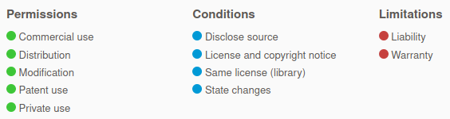
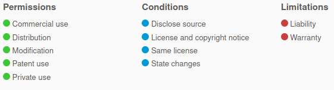

# Licensing

```{questions}
* What is intellectual property/copyright/derivative work?
* What is free software?
* What types of licenses exist?
```

```{objectives}
* Get familiar with terminology around licensing
* Discuss what is and is not derivative work
```

## Intellectual property (IP)


- Patent: **Protects a *novel, non-obvious, technical invention*.**
- **Copyright**: Protects creative expression: software, writing, graphics, photos, certain datasets, this presentation.
- Trademark: **Protects a name/brand from impersonation.**

## Copyright

- Protects creative expression
- Automatically created
- **Derivative works** usually inherit copyright of the thing derived
- Time frame: essentially forever (lifetime + X years)

When can you use:

- When there is a **license** saying you can
- Limited other cases (private use, fair use: context dependent)
- In practice: people do many things, but then can't share their
  output if copyright

**When we write or use software then copyright, licenses, and derivative works are important concepts**

## Derivative work: Changing, remixing, covering

Is this derivative work?



["Distillery District 26"](https://www.flickr.com/photos/dgriebeling/3851273590) CC-BY

## Derivative work

### If you build on something, you form a derivative work

- The original creator may have rights to what you make
- The whole point of this talk is to make sure that **you can make and publish derivative works**
  and **others can make and publish derivative works from you**

```{discussion} Which of these is derivative work?
1. Download some code from a website and add on to it
2. Download some code and use one of the functions in your code
3. Changing code you got from somewhere
4. Extending code you got from somewhere
5. Completely rewriting code you got from somewhere
6. Rewriting code to a different programming language
7. Linking to libraries (static or dynamic), plug-ins, and drivers
8. Clean room design (somebody explains you the code but you have never seen it)
9. You read a paper, understand algorithm, write own code
```
```{solution} Solution
Derivative work: 1-6
Not derivative work: 7,8 and 9.
6 (and 5): This depends on how you do it, see clean room design.
```

## Why could allowing derivative work be good for you as researcher?

- **Quality** control: groups depending on your code will find bugs.
- More applications.
- Globally probably more papers (**more impact**).
- If you make your code citeable, you can measure this impact and use this
  in grant applications.
- Long-term probably also **more papers** for you: new collaborations and projects.
- Groups depending on your code will not want your code to disappear: they might **support you**,
  send improvements, and share maintenance load.

## What is free software?

### Software freedom is the freedom to ...

- ... run the software for **any purpose**: new applications
- ... **study** how the software works and to adapt it to your needs: new applications, less reinventing wheels
- ... **redistribute** copies of the software: more users, more citations
- ... **improve** the software and distribute your improvements to the public: fix bugs, new science

### Typical confusion

- Free software does not mean that software is for free
- Open source license does not mean you need to share everything immediately (share master branch, put unpublished code on a fork)
- Open source does not mean public domain: software in the public domain has no owner
- Open source does not mean non-commercial: plenty of companies produce and support it

## Taxonomy of software licenses

**1. Custom/closed**

- Derivative work typically not possible

**2. Permissive (MIT, BSD, Apache)**


Image unchanged from https://choosealicense.com/

- Derivative work does not have to be shared

**3. Weak copyleft share-alike (LGPL, MPL)**


Image unchanged from https://choosealicense.com/

- Derivative work is free software but is limited to the component

**4. Strong copyleft share-alike (GPL, AGPL)**


Image unchanged from https://choosealicense.com/

- Derivative work is free software and derivative work extends to the combined project

If you would like to learn more check out [Software licensing and open source explained with cakes](https://cicero.xyz/v3/remark/0.14.0/github.com/coderefinery/social-coding/master/licensing-and-cakes.md/)

## Licencing and ownership

**Who can decide about or change a license?**

- The copyright holder

**Who owns the copyright for software you write?**

- **Intellectual property depends on the country and the employer!**
- So-called works made for hire.

**If you own your software:**

- You can change the license.
- You can dual-license (e.g. GPL for anyone, but you can pay for commercial non-GPL).

**If you do not own your software, you can:**

- Request open-sourcing directly (preserves your rights!).
- Request a transfer of ownership (check with your university).

**If you accept contributions (pull requests), you may not be the only owner anymore!**

- Clarify licensing strategy **before** - otherwise you won't have
  all rights to your code.

## Practical recommendations for licenses

- **You cannot ignore licensing**: default is "no one can make copies or
  derivative works".
- License your code **very early** in the project:
  ideally develop publicly accessible open source code **from day one**. Start with a `README.md` and a `LICENSE`. Use github recommendation or/and [Choose an open source license](https://choosealicense.com/)
- Add also the files `CONTRIBUTING.md` and `CODE_OF_CONDUCT.md`. See [Mozilla Introduction to Contributor Guidelines](https://mozilla.github.io/open-leadership-training-series/articles/building-communities-of-contributors/write-contributor-guidelines/) and/or good example: https://github.com/KirstieJane/STEMMRoleModels
- Emphasize open source nature of the code output in your research proposal.
- Take an [OSI](https://opensource.org/licenses)-approved license: makes it easier to evaluate
  [compatibility](https://en.wikipedia.org/wiki/License_compatibility).
- Add a `LICENSE` file to your repository.
- **Do not design your own custom licenses** for open source/ open use: compatibility not clear.
- Open source your code to make sure you are not locked out of your own code if you don't own it
  once you change affiliation.

```{discussion} Datasets

What:
- The EU has a [database directive](https://en.wikipedia.org/wiki/Database_Directive) which restricts data mining on
  databases.
- Has a somewhat similar effect to copyright, because copyright would
  not apply to data mining.
- A good license also gives rights to data mine. So not a major concern.

When you can use datasets:
- The license allows
- Your country has exceptions for research
- The data doesn't come from the EU

License text, slides, images, and supporting information under a
[Creative Commons license](https://creativecommons.org/licenses/), and get a DOI using
[Zenodo](https://zenodo.org) or [Figshare](https://figshare.com).

Services for sharing and collaborating on research data: [https://coderefinery.github.io/reproducible-research/06-sharing/#services-for-sharing-and-collaborating-on-research-data](https://coderefinery.github.io/reproducible-research/06-sharing/#services-for-sharing-and-collaborating-on-research-data)
```

```{challenge} Exercises
1. What is the StackOverflow license for code you copy and paste?
2. A journal requests that you release your software during publication. You have
   copied a portion of the code from another package, which you have forgotten.
   Can you satisfy the journal's request?
3. You want to fix a bug in a project someone else has released, but there is no license. What risks are there?
4. How would you ask someone to add a license?
5. You incorporate MIT, GPL, and BSD3 licensed code into your project. What possible licenses can you pick for your project?
6. You do the same as above but add in another license that looks viral. What possible licenses can you use now?
7. Do licenses apply if you don't distribute your code? Why or why not?
8. Which licenses are most/least attractive for companies with proprietary software?
```

```{keypoints}
- Always add a license

```
