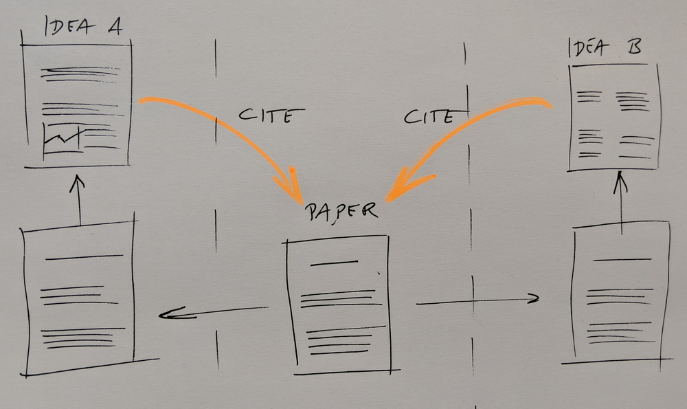
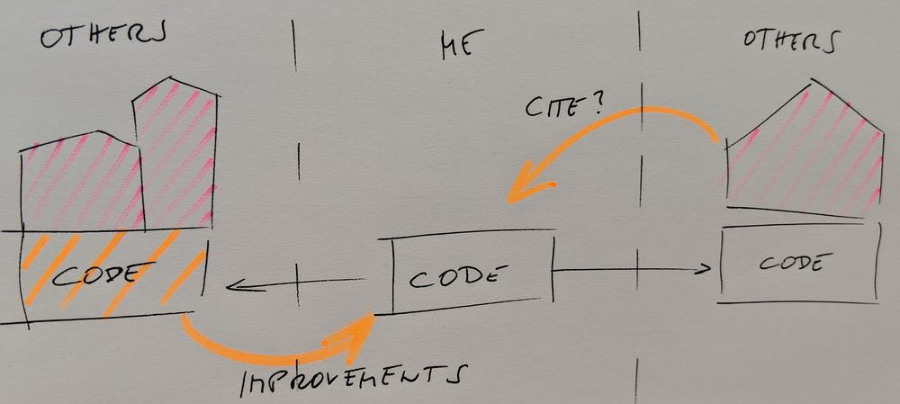
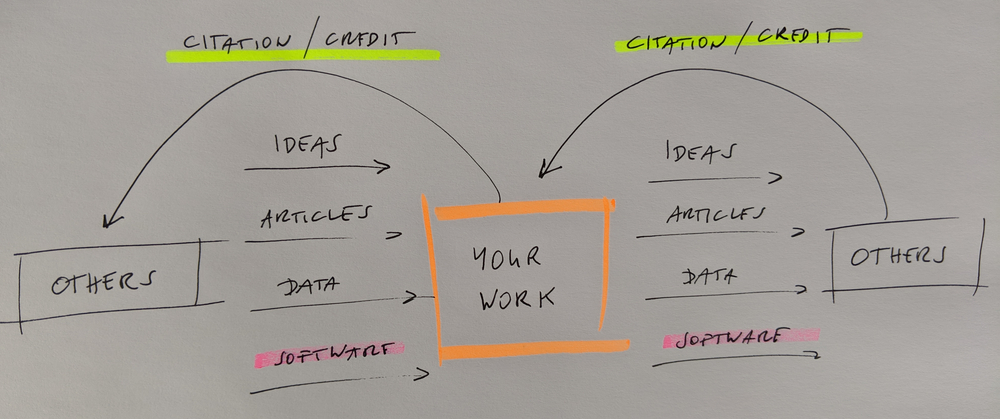

class: center, middle

# Social coding and open software

Text is free to share and remix under [CC-BY-4.0](https://creativecommons.org/licenses/by/4.0/)

Radovan Bast, Richard Darst, Sabry Razick, Jyry Suvilehto

Thanks for great suggestions/corrections: Anne Fouilloux, Oxana Smirnova, Lucy Whalley

---

## Target audience

- Someone writing their own relatively small material
- Someone who wants to incorporate other code/libraries into their own projects
- Group leader who wants to decide how to balance openness and long-term strategy

### Plan

- Social coding
- Licensing
- Software citation

---

class: center, middle

## Part 1/3: Social coding

---

## Sharing papers and academic credit



- We want maximum visibility and maximum reuse.
- The more interesting science is done referencing my paper, the better for me.

---

## What do we mean by sharing, in this presentation

During this lecture when we say .emph[sharing], we mean in the context of .emph[openness]. 

- Anyone can legally inspect, modify, fix errors and provide enhancements. 
- Sharing the underlying source code of software, Thus, this differs from sharing a 
  copy of an executable (Discuss this in connection with different scripting and 
  programing languages e.g. Python, R ,Java, C , Fortran, Bash). 


---
## Group work before we go on

Discuss in pairs or groups (5-10 minutes):

- What is .emph[software sharing] ?  
- Come up with .emph[reasons for sharing] your scripts/code/data
- Also think about .emph[reasons for not sharing]
- Why is software often treated differently from papers

We will discuss our findings as a class.

---

## What are the benefits of sharing software?

- Easier to find and reproduce (.emph[scientific reproducibility])
- More trustworthy: others can verify correctness and find and report bugs
- Enables others to build on top of your code (derivative work, 
  .emph[provided the license allows it])
- Others can submit features/improvements
- Others can fix bugs
- Many tools and apps are free for open source
  ([GitHub](https://github.com), [Travis CI](https://travis-ci.org),
  [Appveyor](https://www.appveyor.com), [Read the Docs](https://readthedocs.org))
- Good for your CV: you can show what you have built

---

## Sharing is scary (1/2)

- Fear of being scooped
> .remark[Very unlikely that others will understand your code and publish before you without involving you in a collaboration. Sharing is a form of publishing.]
- Exposes possibly "ugly code"
> .remark[In practice almost nobody will judge the quality of your code.]
- Others may find bugs
> .remark[Isn't this good? Would you not like to use a code which gives people the chance to locate bugs?]

---

## Sharing is scary (2/2)

- Others may require support and ask too many questions
> .remark[This can become a problem: use tools and community and protect your time.]
- Fear of losing control over the direction of the project
> .remark[Open source does not mean everybody can change **your version**.]
- "Bad" derivative projects may appear
> .remark[It will be clear which is the official version.]

---

## Sharing code



.quote["I did all the ground work and they get to do the interesting science?"]

- Sharing code and encouraging .emph[derivative work] may boost your academic impact.

---

## Journal policy as motivation for sharing

[From Science editorial policy:](https://www.sciencemag.org/authors/science-journals-editorial-policies)
> "We require that all computer code used for modeling and/or data analysis
> that is not commercially available be deposited in a publicly accessible
> repository upon publication. In rare exceptional cases where security
> concerns or competing commercial interests pose a conflict, code-sharing
> arrangements that still facilitate reproduction of the work should be
> discussed with your Editor no later than the revision stage."

 [From Nature editorial policy:](https://www.nature.com/authors/policies/availability.html)
> "An inherent principle of publication is that others should be able to
> replicate and build upon the authors' published claims. A condition of
> publication in a Nature Research journal is that authors are required to make
> materials, data, code, and associated protocols promptly available to readers
> without undue qualifications. Any restrictions on the availability of
> materials or information must be disclosed to the editors at the time of
> submission. Any restrictions must also be disclosed in the submitted
> manuscript."

---

## Journal policy as motivation for sharing

However a study showed that despite these policies, many people still do not share their code 😞 : [https://www.pnas.org/content/115/11/2584](https://www.pnas.org/content/115/11/2584). This paper includes samples of charming author responses such as
> "When you approach a PI for the source codes and raw data, you better explain
> who you are, whom you work for, why you need the data and what you are going
> to do with it."

---

## Social coding



- Whether you can share your output depends on how you obtained your input.
- .emph[Software licenses] matter.
- Sometimes "OTHERS" are you yourself in the future in a different group/job.

---

## Motivation for open source software

- Enable derivative work
- Do not lock yourself out of own code
- Attract developers who want to be able to show the coding work on their CVs
- Tightly regulated domains require open source
- OSS can lead to more engagement from industry which may lead to more impact
- If it's not open, it is not likely to become standard

---

## Code reuse

Should you reuse things that others have done?

Types of things that can be reused:
- Main libraries (e.g. numpy, scipy)
- Special scientific libs
- Random code from website
- Copying from Stack Overflow

Do you want others to reuse what you make?

How do you turn your own small project into the next numpy? Do you want to?

---

## What contributes to reuse?

What contributes to you being able to reuse stuff that others make, and others (or you) being able to reuse your stuff?

As a .emph[developer] or .emph[user] what are you looking at when discovering a new package?

Discuss in groups ...

---

### As a .emph[developer] or .emph[user] what are you looking at when discovering a new package?

These are common things to check:

- Date of last code change .remark[... is the project abandoned?]
- Release history .remark[... how about stability and backwards-compatibility?]
- Versioning .remark[... will it be painful to upgrade?]
- Number of open pull requests and issues - are they followed-up?
- Installation instructions .remark[... will it be difficult to get it running?]
- Example .remark[... will it be difficult to get started?]
- License .remark[... am I allowed to use it?]
- Contribution guide .remark[... how to contribute and decision process?]
- Trust and community .remark[... somebody you trust recommended it?]

### This is what we teach in [CodeRefinery](https://coderefinery.org):

- Version control including project management
- Testing
- Documentation
- Reproducibility
- Code citations
- Being findable
- Licensing

---

## FAIR principles


.cite[(c) [Scriberia](http://www.scriberia.co.uk) for [The Turing Way](https://the-turing-way.netlify.com), CC-BY.]

For a discussion of FAIR in the context of software, see https://softdev4research.github.io/4OSS-lesson/.

---

class: center, middle

## Part 2/3: Licensing

---

## Intellectual property (IP)


- Patent: .remark[Protects a *novel, non-obvious, technical invention*.]
- .emph[Copyright]: .remark[Protects creative expression: software, writing, graphics, photos, certain datasets, this presentation.]
- Trademark: .remark[Protects a name/brand from impersonation.]

---

## Copyright

- Protects creative expression
- Automatically created
- .emph[Derivative works] usually inherit copyright of the thing derived
- Time frame: essentially forever (lifetime + X years)

When can you use:

- When there is a .emph[license] saying you can
- Limited other cases (private use, fair use: context dependent)
- In practice: people do many things, but then can't share their
  output if copyright

### When we write or use software then copyright, licenses, and derivative works are important concepts

---

## Derivative work: Changing, remixing, covering

Is this derivative work?


.cite["Distillery District 26", CC-BY, https://www.flickr.com/photos/dgriebeling/3851273590]

---

## Derivative work

### If you build on something, you form a derivative work

- The original creator may have rights to what you make
- The whole point of this talk is to make sure that .emph[you can make and publish derivative works]
  and .emph[others can make and publish derivative works from you]

---

## Which of these is derivative work?

### Discuss in groups

- Download some code from a website and add on to it
- Download some code and use a function in your code
- Changing the code
- Extending the code
- Completely rewriting the code
- Rewriting the code to a different programming language
- Linking to libraries (static or dynamic), plug-ins, and drivers
- Clean room design (somebody explains you the code but you have never seen it)
- You read a paper, understand algorithm, write own code

---

## Why could allowing derivative work be good for you as researcher?

- .emph[Quality] control: groups depending on your code will find bugs.
- More applications.
- Globally probably more papers (.emph[more impact]).
- If you make your code citeable, you can measure this impact and use this
  in grant applications.
- Long-term probably also .emph[more papers] for you: new collaborations and projects.
- Groups depending on your code will not want your code to disappear: they might .emph[support you],
  send improvements, and share maintenance load.

---

## What is free software?

### Software freedom is the freedom to ...

- ... run the software for .emph[any purpose]: .remark[new applications]
- ... .emph[study] how the software works and to adapt it to your needs: .remark[new applications, less reinventing wheels]
- ... .emph[redistribute] copies of the software: .remark[more users, more citations]
- ... .emph[improve] the software and distribute your improvements to the public: .remark[fix bugs, new science]

### Typical confusion

- Free software does not mean that software is for free
- Open source license does not mean you need to share everything immediately (share master branch, put unpublished code on a fork)
- Open source does not mean public domain: software in the public domain has no owner
- Open source does not mean non-commercial: plenty of companies produce and support it

<!---
Example: Ubuntu is free software.  It is supported by a company called
Canonical.  Many people make free software.  Canonical packages it up as
Ubuntu.  Because the software guarantees freedom, Canonical can't make Ubuntu
closed-source.  Canonical doesn't make money out of the software itself - only
their actual value-added services which they offer to companies.

Example: you come up with a formula and a piece of software to improve a
chemical process.

Relate this to the value of what people have and want - much software is so
small it isn't/can't be sold, but through a proper license others can help it
make an impact.
-->

---

## Taxonomy of software licenses

### 1. Custom/closed

- Derivative work typically not possible

### 2. Permissive (MIT, BSD, Apache)

- Derivative work does not have to be shared

### 3. Weak copyleft share-alike (LGPL, MPL)

- Derivative work is free software but is limited to the component

### 4. Strong copyleft share-alike (GPL, AGPL)

- Derivative work is free software and derivative work extends to the combined project

---

### If you would like to learn more

- [Software licensing and open source explained with cakes](https://cicero.xyz/v3/remark/0.14.0/github.com/coderefinery/social-coding/master/licensing-and-cakes.md/)

### Who can decide about or change a license?

- The copyright holder

### Who owns the copyright for software you write?

- .emph[Intellectual property depends on the country and the employer!]
- So-called works made for hire.

### If you own your software:

- You can change the license.
- You can dual-license (e.g. GPL for anyone, but you can pay for commercial non-GPL).

---

### If you do not own your software, you can:

- Request open-sourcing directly (preserves your rights!).
- Request a transfer of ownership (check with your university).

### If you accept contributions (pull requests), you may not be the only owner anymore!

- Clarify licensing strategy .emph[before] - otherwise you won't have
  all rights to your code.

<!--- Fun story: I once had a friend who worked at IBM.  In their
division, they always tried to open-source what they worked on,
because if they didn't some other division could come and take it away
from them to put in some product.  By open sourcing, they ensure even
their internal rights to do their work! -->

---

## Practical recommendations for licenses

- .emph[You cannot ignore licensing]: default is "no one can make copies or
  derivative works".
- License your code .emph[very early] in the project:
  ideally develop publicly accessible open source code .emph[from day one]. Start with a `README.md` and a `LICENSE`.
- Add also the files `CONTRIBUTING.md` and `CODE_OF_CONDUCT.md`. Good example: https://github.com/KirstieJane/STEMMRoleModels
- Emphasize open source nature of the code output in your research proposal.
- Take an [OSI](https://opensource.org/licenses)-approved license: makes it easier to evaluate
  [compatibility](https://en.wikipedia.org/wiki/License_compatibility).
- Add a `LICENSE` file to your repository.
- .emph[Do not design your own custom licenses] for open source/ open use: compatibility not clear.
- Open source your code to make sure you are not locked out of your own code if you don't own it
  once you change affiliation.

---

## Datasets

What:
- The EU has a database directive which restricts data mining on
  databases.
- Has a somewhat similar effect to copyright, because copyright would
  not apply to data mining.
- A good license also gives rights to data mine. So not a major concern.

When you can use datasets:
- The license allows
- Your country has exceptions for research
- The data doesn't come from the EU

License text, slides, images, and supporting information under a
[Creative Commons license](https://creativecommons.org/licenses/), and get a DOI using
[Zenodo](https://zenodo.org) or [Figshare](https://figshare.com).

Services for sharing and collaborating on research data: https://coderefinery.github.io/reproducible-research/03-sharing/#services-for-sharing-and-collaborating-on-research-data

---

## Exercises

1. What is the StackOverflow license for code you copy and paste?
2. A journal requests that you release your software during publication. You have
   copied a portion of the code from another package, which you have forgotten.
   Can you satisfy the journal's request?
3. You want to fix a bug in a project someone else has released, but there is no license. What risks are there?
4. How would you ask someone to add a license?
5. You incorporate MIT, GPL, and BSD3 licensed code into your project. What possible licenses can you pick for your project?
6. You do the same as above but add in another license that looks viral. What possible licenses can you use now?
7. Do licenses apply if you don't distribute your code? Why or why not?
8. Which licenses are most/least attractive for companies with proprietary software?

---

## Great resources

- http://depth-first.com/articles/2006/12/29/dispelling-open-source-confusion-an-introduction-to-licenses/
- http://oss-watch.ac.uk/resources/ipr
- http://rkd.zgib.net/scicomp/open-science/open-science.html
- https://choosealicense.com (can send automatic pull request to your GitHub repo)
- https://hintjens.gitbooks.io/social-architecture/content/chapter2.html
- https://softdev4research.github.io/4OSS-lesson/
- https://softdev4research.github.io/recommendations/
- https://tldrlegal.com/
- https://users.aalto.fi/~darstr1/cheatsheets/ipr-cheatsheet.pdf
- https://www.software.ac.uk/choosing-open-source-licence
- http://www.oreilly.com/openbook/osfreesoft/
- http://www.rosenlaw.com/oslbook.htm
- http://lib.tkk.fi/Diss/2005/isbn9529187793/isbn9529187793.pdf
- https://www.software.ac.uk/resources/guides/adopting-open-source-licence
- https://jacobian.org/2009/sep/17/contributor-license-agreements/

---

class: center, middle

## Part 3/3: Software citation

---

## Software citation

- Do you cite software that you use? How?
- If I wanted to cite your code/scripts, what would I need to do?

---

## Software citation

- Get a [DOI](https://en.wikipedia.org/wiki/Digital_object_identifier) using [Zenodo](https://zenodo.org).
- Open source license can't demand citation, but it is required by science ethics anyway.
- Make it as easy as possible! Clearly say what you want cited.
- Make it easy for scripts and tools, use the [Citation file format](https://citation-file-format.github.io):

```
cff-version: 1.0.3
message: If you use numgrid, please cite it as below.
authors:
  - family-names: Bast
    given-names: Radovan
title: numgrid
version: 1.0.2
doi: 10.5281/zenodo.1470277
date-released: 2018-10-24
```

### Publishing papers about software

- [The Journal of Open Source Software](https://joss.theoj.org/about)
- [In which journals should I publish my software?](https://www.software.ac.uk/resources/guides/which-journals-should-i-publish-my-software)
- https://www.force11.org/software-citation-principles

---

## Where to place your code

- https://github.com: public (unlimited) or private (up to 3 collaborators or unlimited educational) repositories
- https://gitlab.com: public or private repositories
- https://source.coderefinery.org: public or private repositories

### Making code public is not enough! Why? Get a DOI in addition.

---

## Conclusions

- License your code .emph[very early] in the project:
  ideally develop publicly accessible open source code .emph[from day one].
- Make it easy to cite your code ([Zenodo](https://zenodo.org))
- Please help us to improve this material: https://github.com/coderefinery/social-coding

### Discussion

- Who owns the code that you write?
- Does your code/script have a license?
- Can you take your own code with you after the PhD?
- Are you using open source software in your work?
- What are your thoughts about sharing software with your colleagues or competitors?
