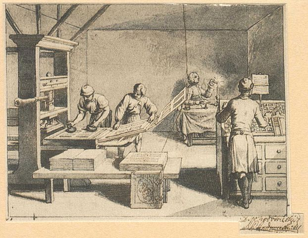

name: inverse
layout: true
class: middle, inverse

---

# Social coding and open software

## [Radovan Bast](https://bast.fr) (NeIC, UiT-The Arctic University of Norway)

Text is free to share and remix under
[CC-BY-SA-4.0](https://creativecommons.org/licenses/by-sa/4.0/).

Based on material with contributions by:
- Richard Darst
- Sabry Razick
- Oxana Smirnova
- Jyry Suvilehto

---

layout: false

.left-column[
# Plan for this talk
]

.right-column[
## - Why software matters in research
## - Why open software
## - How to do open software
## - How to grow a community around your code
]

---

## Why software matters in research

**Data** is part of research output

- Funding agencies often ask for a data management plan

**Software** is part of research output

- Simulations which generate data
- Control software for instruments
- Post-processing of measurements
- Data processing
- Portals and apps
- Spreadsheets
- Scripts and tools which produce graphs and compute statistics
- Across disciplines

Curiosity: Not too many projects consider a software management plan.

.blue[The big keyword in this talk is **reproducibility**.]

---

## Examples

- Discovery of gravitational waves
  - Tutorials: https://www.gw-openscience.org/tutorials/
  - Software: https://www.gw-openscience.org/software/

- Stanford Activity Inequality study
  - Overview: http://activityinequality.stanford.edu
  - Code is on GitHub: https://github.com/timalthoff/activityinequality

Challenge:
1. Think of a recent major scientific discovery
2. Imagine it without software
3. Imagine it without open source software

---

## Sharing is caring

### .blue[What are the benefits of sharing software?]

- Easier to find and reproduce (.blue[scientific reproducibility])
- Others can verify correctness and find and report bugs
- Enables others to build on top of your code (derivative work, provided the license allows it)
- Others can submit features/improvements
- Others can fix bugs
- Many tools and apps are free for open source
  ([GitHub](https://github.com/), [Travis CI](https://travis-ci.org),
  [Appveyor](https://www.appveyor.com), [Read the Docs](https://readthedocs.org))
- Good for your CV: you can show what you built

---

## Sharing is scary

### .blue[Why do some researchers prefer not to share?]

- Fear of being scooped
- Exposes possibly "ugly code"
- Others may find bugs
- Others may require support and ask too many questions
- Fear of losing control over the direction of the project
- "Bad" derivative projects may appear - fear that this will harm the reputation

---

- Fear of being scooped
> .blue[Very unlikely that others will understand your code and publish before you without involving you in a collaboration.]
- Exposes possibly "ugly code"
> .blue[In practice almost nobody will care/judge.]
- Others may find bugs
> .blue[Isn't this good? Would you not like to use a code which gives people the chance to locate bugs?]
- Others may require support and ask too many questions
> .blue[More about this later.]
- Fear of losing control over the direction of the project
> .blue[Open source does not mean everybody can change **your** code.]
- "Bad" derivative projects may appear
> .blue[Use non-endorsement licenses. It will be clear which is your official version.]

---

## Reproducibility - generally speaking

- "The public" should be able to **find your code**
- It should be possible to locate the same **version** that you have used in your paper
- Document the **dependencies**
- Document the **environment** (possibly using a Docker file)
- Provide **install instructions**
- Make it possible to **test and verify** the installation

---

---

## Reproducibility - practically speaking (1/2)

- Use version control (track changes to your code, more about it below).
- In the published paper note the **precise version** which you have used.
- If possible, make the sources available.
- At the minimum move them from a dusty hard-drive to a place with backup.
- Placing your code on [GitHub](https://github.com) is very good but it is not enough (https://www.softwareheritage.org).
- Get a [DOI](https://en.wikipedia.org/wiki/Digital_object_identifier) using [Zenodo](https://zenodo.org).

---

## Reproducibility - practically speaking (2/2)

- Document dependencies **with versions** (use [Pipenv](https://pipenv.readthedocs.io) in Python projects).
- If your code needs to be built/compiled, document how.
- Consider sharing a Docker file.
- Your output files, output data, output images should contain information about input files and **code versions**.
- Prefer scripts over graphical point-and-click solutions.
- Document your data processing workflow with a script or Makefile or similar.
- Consider collecting and sharing your scripts in a Jupyter notebook.
- Share your data - e.g. using https://dataverse.no.

---

## Version control

---

## GitHub and friends

where to place your code

2 slides

---

## Code review

- collaboration and peer review using GitHub/GitLab

2 slides

---

## Software licensing: Copyright vs. patent vs. trademark

- Copyright: You are Goethe and your writings are widely published, you are
  given a right to some of the proceeds from selling copies (.blue[expression of an idea])
- Patent: You invented a better printing press and are given the exclusive
  to manufacture printing presses that use the technique (.blue[invention])
- Trademark: You start selling the printing press with the name AutoPress, which
  distinguishes your press from others (.blue[ownership]).

<!--
Printing press was the reason copyright was necessary in the first place.
Before the printing press copying anything was manual labour and the cost of
copies was mainly in the act of copying. After the printing press copying
became so simple that it was no longer a major cost: there was money left over
and the question was should it go all to the printer or some also to the writer.
-->

---

## We will focus on copyright and creative expression

- **Facts are always free**
- Copyright protects the **creative expression** of an idea
- Automatically attached to every *novel* expression (certain amount of years)
- Software that you write is **copyrighted by default** (comparable to
  literature or poetry)
- The owner of copyright has the right to dictate *distribution and creation of copies*
- No-one besides copyright holder has the right to create "derivative works" (unless the license permits it)
- Who is the copyright owner? It depends!
- "Fair use rules" are an exception:
  - Parody
  - Criticism
  - Quotation

<!---
This talk is mostly about copyright.  Patents are a much more
complex and limited concept.  Most software can't be patentatable, and
after you publish your ideas, patenting is impossible.  So, we
focus on copyright, as you should too.
-->

---

## Relation to scientists

- You come up with **ideas**
- Ideas are published in **papers**
  - Papers might have limited access, but *anyone* can use the ideas in them
  - Your goal is to get citations for your paper by people using or improving your ideas
- Your **software** may implement an idea in your paper
  - For your ideas to be used, software should be usable
  - If people can use or **improve your software**, they can more easily use your ideas
  - If people cannot reuse and extend your software, **its impact will be limited**

<!---
Maybe scientists aren't the only audience, but may be useful to start here anyway.

- Emphasize that trying to protect your code usually doesn't do you
  that much good: your ideas are purposely put out there when you
  publish.
- If your code isn't free software, people might take your code and
  run it, but not reuse it.  Following up on your work becomes much
  harder, since they have to re-create everything.

Copyright protects a certain expression.  If you publish a paper on
your idea, someone can always read that paper and re-create your
method.  Don't think that copyright gives you magic protection.
-->

---

## What is free software?

### Free as in beer or free as in speech?

(Emoji icons provided free by [EmojiOne](https://www.emojione.com))

### Software freedom

Is the freedom to ...

- ... run the software for any purpose
- ... study how the software works and to adapt it to your needs
- ... redistribute copies of the software
- ... improve the software and distribute your improvements to the public

---

## What is free software?

### Software freedom and research

Is the freedom to ...

- ... run the software for any purpose .blue[-> new applications]
- ... study how the software works and to adapt it to your needs .blue[-> new applications, less reinventing wheels]
- ... redistribute copies of the software .blue[-> more users, more citations]
- ... improve the software and distribute your improvements to the public .blue[-> fix bugs, new science]

### Typical confusion

- Free software does not mean that software is for free
- Open source license does not mean you need to share everything immediately
- Open source does not mean public domain: software in the public domain has no owner
- Open source does not mean non-commercial: plenty of companies produce and support it

<!---
Example: Ubuntu is free software.  It is supported by a company called
Canonical.  Many people make free software.  Canonical packages it up as
Ubuntu.  Because the software guarantees freedom, Canonical can't make Ubuntu
closed-source.  Canonical doesn't make money out of the software itself - only
their actual value-added services which they offer to companies.

Example: you come up with a formula and a piece of software to improve a
chemical process.

Relate this to the value of what people have and want - much software is so
small it isn't/can't be sold, but through a proper license others can help it
make an impact.
-->

---

## In practice you need to choose a license

- Without a license it is not clear what use breaks copyright.
- Code without license is not useful for reuse or derivative work.
- Example why choice of license matters, X vs. SunView: https://lwn.net/Articles/26608/

## Software licensing and open source explained with cakes

- Imagine you compose a recipe for a really tasty cake (a great idea).
- In regular intervals you distribute cakes (release binaries).
- Your family and friends love it.
- But you can only bake so many.

(cake emoji licensed under CC-BY-SA-4.0, attribution: [EmojiOne](https://www.emojione.com))

<!--- Perhaps may be worth saying that this is a metaphor - the
ingredients list and basic instructions simply facts, so not
protectable.  However, your description *is* protectable. -->

---

## Possible outcomes 0/4: closed

### Closed source (recipe never released)

- Your cake is celebrated by The New Yorker magazine.
- People will have difficulties to reproduce your celebrated recipe.
- Nobody else will improve your recipe.
- Bad copycats might appear, you don't get any credit.
- Fewer tasty cakes will get consumed.

---

## A friend tells you: why not distribute the recipe?

- Put your recipe on GitHub.
- Start the OpenCake organization.
- Get feedback / start a mailing list.
- More people will be able to enjoy the cake (increase impact).
- Maybe somebody will find ways to improve the recipe.
- Everyone will know that it was your idea even though somebody else bakes it.

---

## Mrs. X (running a famous restaurant) finds your cake recipe on GitHub

- The chef tries it and it is great.
- The chef suggests improvements (derivative work):

- It becomes part of the restaurant menu.
- Or does it? Depends on your license!

<!--- What is most important is *how are the changes handled*.  Since
you are giving the recipe out yourself, people can use it "personally"
however they want.  But if they want to improve/reuse/redistribute it,
then what?  -->

---

## Possible outcomes 1/4: custom

### No license or custom license

- No restaurant chef will touch it: too much hassle to employ a lawyer to be sure
  that the cake can be served to customers.
- But maybe they will bake it and eat it and not distribute it and that is OK
  ("fair use" provision permits the making of copies for own use).

<!--- The restaurant industry is infamous for copying recipes and there are
very few published court cases. Let's skim over this fact and stay in the
fictitious example though. -->

---

## Possible outcomes 2/4: permissive

### License: MIT or Apache or BSD-2

- It is OK to use the recipe and sell the cake.
- It is OK to not share the improved recipe.
- If somebody becomes sick, it is not the fault of the OpenCake organization (limit of liability).
- You may not get the improvements back to use yourself.

### License: BSD-3

- In addition to the above it is understood that the updated recipe are not endorsed by the OpenCake organization.

---

## Possible outcomes 3/4: share-alike

### License: GNU Lesser GPL (LGPL)

- The famous restaurant has to share only the improved cake recipe but can keep the rest of the menu closed.
- The restaurant guests have to be able to exchange the cake from the menu by improved cakes from other restaurants (dynamic relinking).

### License: Mozilla Public License v2.0

- Like LGPL but do not require that the modified cake can be exchanged by the restaurant guest.

---

## Possible outcomes 4/4: viral

### License: GNU GPL or GNU Affero GPL

- If the cake is a part of the menu, the famous restaurant has to share the recipes of the **entire menu**.
- You can use their improved recipe and improve it further:

- Other restaurants can then reuse and improve the full menu and the hope is that we will all eat better food.
- You support open restaurants. You can use everything they do, too.

<!--- Example of benefits of virality in software: Linksys routers and
GPL's kernel image. Some company used linux, didn't distribute source.
They were fourced to distribute it, and that has directly led to
a huge community of firmware modders.  -->

---

## What outcomes did we have?

### 1. Custom/closed

- Others have to reimplement the wheel
- No improvement or **derivative work**

### 2. Permissive

- Attractive for commercial software companies
- No guaranteed access to **derivative work**

### 3. Share-alike

- Compatible with proprietary software
- You can reuse **derivative work**

### 4. Viral

- You have to share the **derivative work** and cannot restrict access
- Not attractive for commercial software companies

---

## Derivative work

### Is derivative work

- Extending the code
- Completely rewriting the code
- Rewriting the code to a different programming language

### Typically not derivative work

- Linking to libraries (static or dynamic), plug-ins, and drivers
- Clean room design

---

## Why is allowing derivative work good for you as researcher?

- **Quality** control: groups depending on your code will find bugs.
- More applications.
- Globally probably more papers (**more impact**).
- If you make your code citeable, you can measure this impact and use this
  in grant applications.
- Long-term probably also **more papers** for you: new collaborations and projects.
- Groups depending on your code will not want your code to die: they might **support**
  you, send improvements, and share maintenance load.

---

## Who owns the copyright for software you write?

- You? Your university?
- .blue[Intellectual property depends on the country and the employer!]
- So-called works made for hire.

### If you own your software:

- You can change the license.
- You can dual-license (e.g. GPL for anyone, but you can pay for commercial non-GPL).

### If you accept contributions (pull requests), you may not be the only owner anymore!

- Clarify licensing strategy.

### If you do not own your software, you can:

- Request a transfer of ownership (check with your university).

<!--- Fun story: I once had a friend who worked at IBM.  In their
division, they always tried to open-source what they worked on,
because if they didn't some other division could come and take it away
from them to put in some product.  By open sourcing, they ensure even
their internal rights to do their work! -->

---

## Practical recommendations

### Starting and contributing to a project

- You *can't* ignore licensing: default is "no one can make copies or
  derivative works".
- License your code **very early** in the project.
- Take an [OSI](https://opensource.org/licenses)-approved license: makes it easier to evaluate
  [compatibility](https://en.wikipedia.org/wiki/License_compatibility).
- **Do not use custom licenses** for open source: compatibility not clear.
- Open source your code to make sure you are not locked out of your own code
  once you change affiliation.

### Licensing

- Add a `LICENSE` file to your repository (GitHub understands it):
  - Use GitHub web to add file named `LICENSE` and it helps you select!
  - You should check that GitHub can automatically detect the license.
- License your supporting information (images) under
  creative commons (use [Zenodo](https://zenodo.org) or [Figshare](https://figshare.com)).

### Citations and credit

- More about this in a moment ...

---

## Good resources for software licensing

- https://www.software.ac.uk/choosing-open-source-licence
- https://choosealicense.com
- http://oss-watch.ac.uk/resources/ipr
- http://www.rosenlaw.com/oslbook.htm
- http://depth-first.com/articles/2006/12/29/dispelling-open-source-confusion-an-introduction-to-licenses/
- http://blog.milkingthegnu.org/2008/03/10-answers-for.html
- http://www.oreilly.com/openbook/osfreesoft/
- https://tldrlegal.com/
- https://hintjens.gitbooks.io/social-architecture/content/chapter2.html
- https://users.aalto.fi/~darstr1/cheatsheets/ipr-cheatsheet.pdf

---

## Software citation

- Open source license can't demand citation, but it is required by science ethics anyway.
- Make it as easy as possible! Clearly say what you want cited.
- [Citation file format](https://github.com/citation-file-format/citation-file-format)
- DOI
- Zenodo

---

## Publishing papers about software

Journals ...

---

## Community

- You want to create a *community*, and tools of this course help do that
- There are certain conditions for *taking from the community*
- There are certain ways to *give to the community*

---

## Conclusions and discussion

- Track code using version control, learn Git: https://uit-no.github.io/2018-11-08-uit/
- Use code review: review each other's code changes
- Make it easy to reproduce your computational results
- Open source your code and make it accessible (GitHub, GitLab, Bitbucket)
- Make it easy to cite your code (Zenodo)
- Check out the CodeRefinery project: https://coderefinery.org
